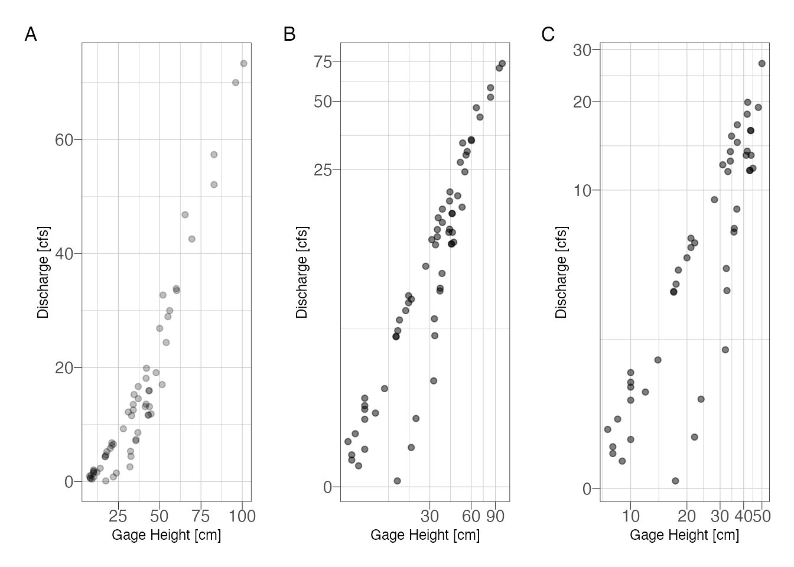
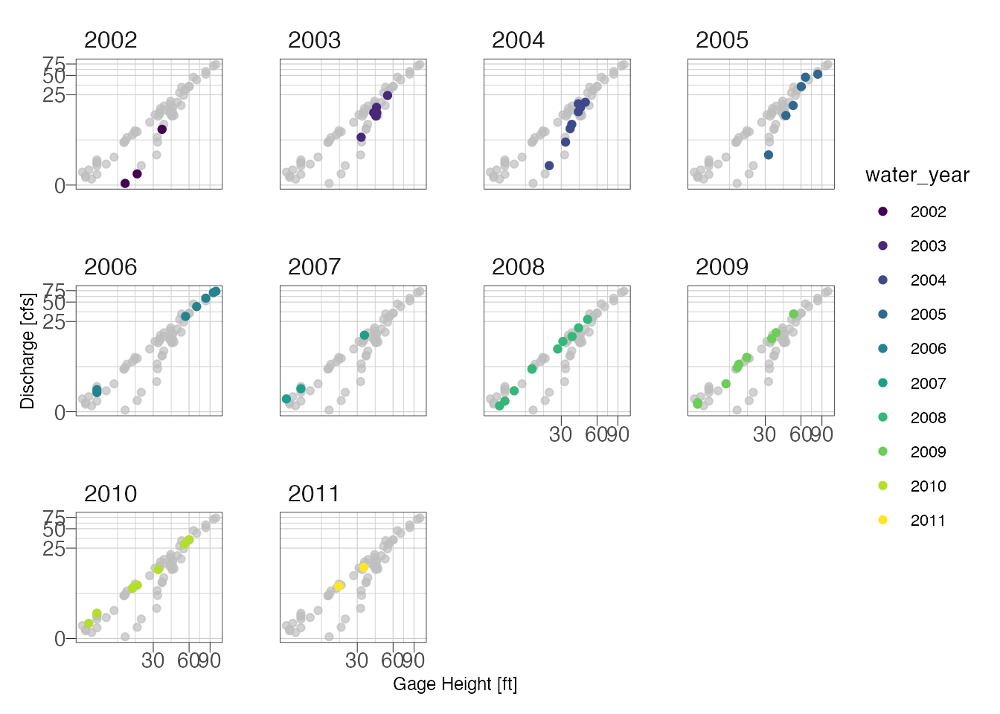
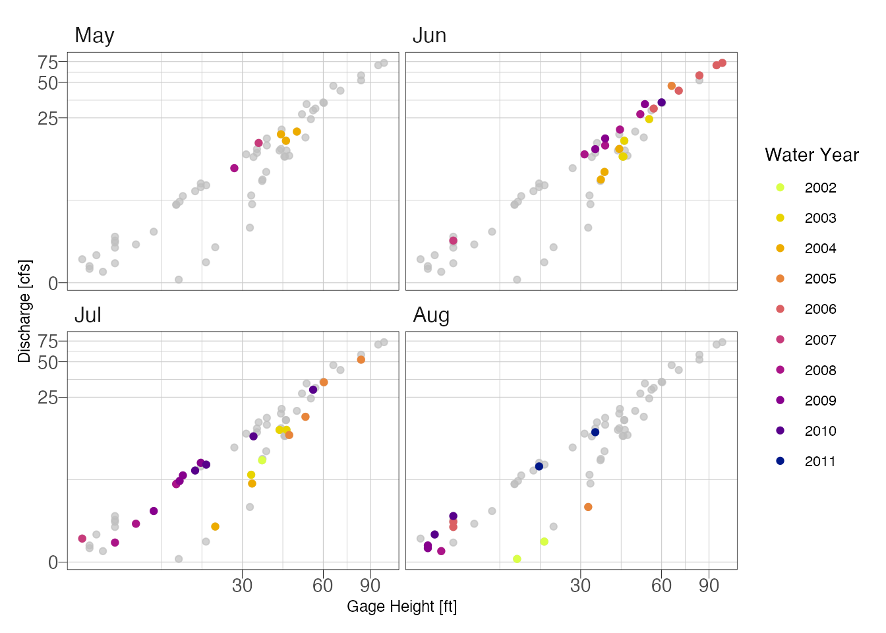
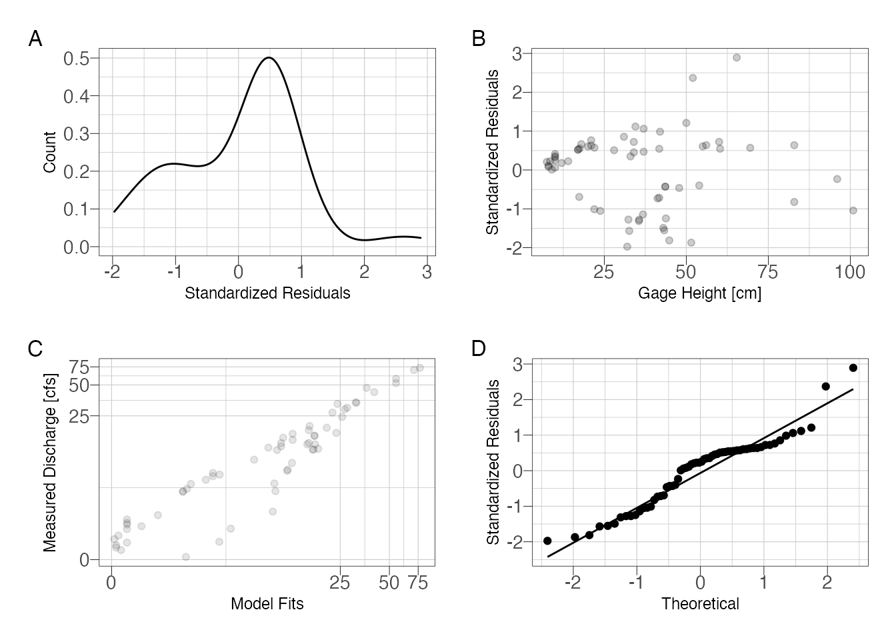
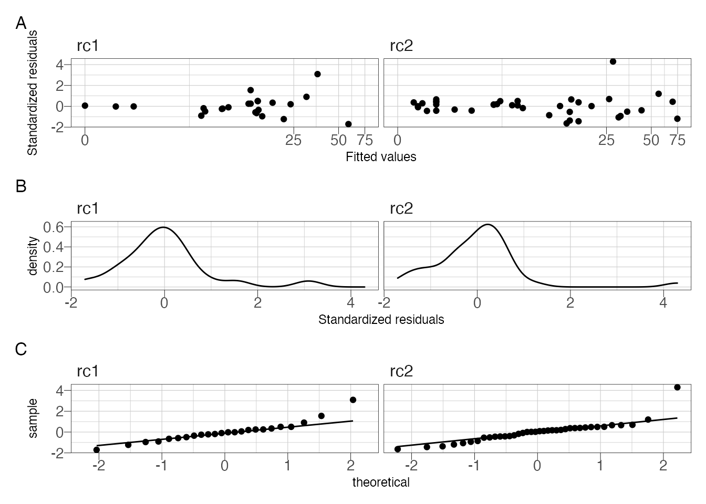
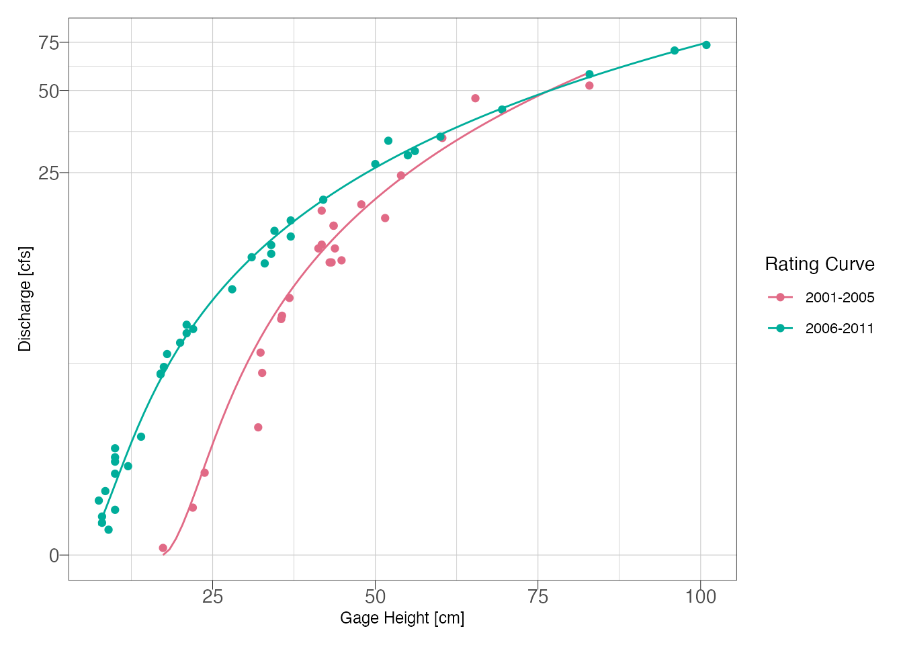

## Prerequisites {-}
The following libraries are used, if you are missing use the `install_packages()` function. `smwrBase` must be installed from Github using: `remotes::install_github("USGS-R/smwrBase")`, which might also require that you install `remotes` if you don't have that installed.

```r
library(hrbrthemes)
library(tidyverse)
library(WaterML)
library(patchwork)
library(smwrBase)
library(lubridate)
library(colorspace)
library(gghighlight)
library(nls.multstart)
library(nlstools)

set.seed(101)

update_geom_font_defaults(font_rc)
```


## Data {-}

The code chunk below downlaods some stage and discharge data from a project in Yosemite that is hosted on the CUASHI hydroserver. The `WaterML` package provides access to download the data into R. For any dataset we need date-time, gage height, and measured discharge.


```r
server <- "http://hydroportal.cuahsi.org/YosemiteHydroclimateNetwork/cuahsi_1_1.asmx?WSDL"
gage <- GetValues(server, siteCode = "YosemiteHydroclimateNetwork:MC1", variableCode = "YosemiteHydroclimateNetwork:GAHGHT") # in cm
```

```
## [1] "downloading values from: http://hydroportal.cuahsi.org/YosemiteHydroclimateNetwork/cuahsi_1_1.asmx ..."
## [1] "download time: 3.5 seconds, status: Success"
## [1] "reading data values WaterML ..."
## [1] "found 50439 data values"
## [1] "processing censorCode..."
## [1] "processing qualifiers..."
## [1] "processing dateTimeUTC..."
## [1] "processing methodCode..."
## [1] "processing sourceCode..."
## [1] "processing qualityControlLevelCode..."
```

```r
discharge <- GetValues(server, siteCode = "YosemiteHydroclimateNetwork:MC1", variableCode = "YosemiteHydroclimateNetwork:SF") # in cfs
```

```
## [1] "downloading values from: http://hydroportal.cuahsi.org/YosemiteHydroclimateNetwork/cuahsi_1_1.asmx ..."
## [1] "download time: 3 seconds, status: Success"
## [1] "reading data values WaterML ..."
## [1] "found 50439 data values"
## [1] "processing censorCode..."
## [1] "processing qualifiers..."
## [1] "processing dateTimeUTC..."
## [1] "processing methodCode..."
## [1] "processing sourceCode..."
## [1] "processing qualityControlLevelCode..."
```


```r
## join the data sets by date
df <- gage %>%
  left_join(discharge, by = c("DateTimeUTC" = "DateTimeUTC")) %>%
  select(DateTimeUTC, GH_Inst = DataValue.x, Flow_Inst = DataValue.y) %>%
  filter(DateTimeUTC >= as.Date("2002-01-01") & DateTimeUTC <= as.Date("2011-12-31")) %>%
  filter(!is.na(GH_Inst))
```


Step one is to plot the data to see if we can fit one function or if we need to fit multiple functions due to seasonal changes, stream channel changes, etc.


```r
p1 <- ggplot(df) +
  geom_point(aes(GH_Inst, Flow_Inst), alpha = 0.25) +
  theme_ipsum_pub(axis_title_just = "c",
                  plot_margin = margin(10, 10, 10, 10),
                  ticks = TRUE) +
  theme(panel.border = element_rect(color = "black",
                                    fill = NA,
                                    size = .25)) +
  labs(x = "Gage Height [cm]",
       y = "Discharge [cfs]")


p2 <- ggplot(df) +
  geom_point(aes(GH_Inst, Flow_Inst), alpha = 0.5) +
  scale_y_continuous(trans = "pseudo_log") +
  scale_x_continuous(trans = "pseudo_log") +
  theme_ipsum_pub(axis_title_just = "c",
                  plot_margin = margin(10, 10, 10, 10),
                  ticks = TRUE) +
  theme(panel.border = element_rect(color = "black",
                                    fill = NA,
                                    size = .25)) +
  labs(x = "Gage Height [cm]",
       y = "Discharge [cfs]")


p3 <- ggplot(df %>% filter(GH_Inst <=50 & GH_Inst >=0)) +
  geom_point(aes(GH_Inst, Flow_Inst), alpha = 0.5) +
  scale_y_continuous(trans = "pseudo_log") +
  scale_x_continuous(trans = "pseudo_log") +
  theme_ipsum_pub(axis_title_just = "c",
                  plot_margin = margin(10, 10, 10, 10),
                  ticks = TRUE) +
  theme(panel.border = element_rect(color = "black",
                                    fill = NA,
                                    size = .25)) +
  labs(x = "Gage Height [cm]",
       y = "Discharge [cfs]")


p1 + p2 + p3 + plot_annotation(tag_levels = "A")
```

<div class="figure">

<p class="caption">(\#fig:explore)Stage-discharge relationship with (A) untransformed scales and (B) semi-log transformed scales to emphasize low-flows</p>
</div>


At low flows it looks like there are 2 possible curves. Try subsetting by water year and season.


```r
df %>%
  mutate(water_year = smwrBase::waterYear(DateTimeUTC)) %>%
  ggplot() +
  geom_point(aes(GH_Inst, Flow_Inst, color = water_year)) +
  scale_y_continuous(trans = "pseudo_log") +
  scale_x_continuous(trans = "pseudo_log") +
  theme_ipsum_pub(axis_title_just = "c",
                  plot_margin = margin(10, 10, 10, 10),
                  ticks = TRUE) +
  theme(panel.border = element_rect(color = "black",
                                    fill = NA,
                                    size = .25)) +
  labs(x = "Gage Height [ft]",
       y = "Discharge [cfs]") +
  gghighlight(use_direct_label = FALSE) +
  facet_wrap(~water_year)
```




```r
df %>%
  mutate(month = lubridate::month(DateTimeUTC, label = TRUE),
         water_year = smwrBase::waterYear(DateTimeUTC)) %>%
  ggplot() +
  geom_point(aes(GH_Inst, Flow_Inst, color = water_year)) +
  scale_y_continuous(trans = "pseudo_log") +
  scale_x_continuous(trans = "pseudo_log") +
  theme_ipsum_pub(axis_title_just = "c",
                  plot_margin = margin(10, 10, 10, 10),
                  ticks = TRUE) +
  theme(panel.border = element_rect(color = "black",
                                    fill = NA,
                                    size = .25),
        panel.spacing = unit(.05, "inches")) +
  labs(x = "Gage Height [ft]",
       y = "Discharge [cfs]") +
  gghighlight(use_direct_label = FALSE) +
  colorspace::scale_color_discrete_sequential(palette = "Plasma", name = "Water Year") +
  facet_wrap(~month)
```



Looking at the above plot, it appears the primary shift was not seasonal but due temporal. We can probably fit two curves, one for years 2001-2005 and another for 2006-2011.


## Power Function {-}

### Single Power Function {-}

First try the standard power function approach on non-transformed data. We will try against the full dataset then against subset data.

https://www.tandfonline.com/doi/pdf/10.1080/02626667009493957?needAccess=true


$$
Q = K(H - H_0)^z
$$

where:

$Q$ = discharge in cfs;
$H$ = stage in feet;
$H_0$ = stage at zero flow (in feet);
$K$ and $z$ are parameters determined by fitting stage-discharge measurements.

Sometimes we know $H_0$ based on observed data and can plug the known value in. It is also possible to estimate it using regression. Here I am going to let the non linear least squares solve for the best value because we are likely going to fit multiple models anyways. You should check to make sure that the the solved parameter makes sense (not negative or highly positive). $K$ is equal to the discharge at which $(H-H_0) = 0$ and $Z$ describes the slope. Using the `nls()` function requires the analyst provide some starting parameters, the choice of starting parameters is important because the model can converge on the wrong solution or fail to find a solution if the parameters are far away from the optimal answer. Using the `nls_multstart()` function from the `nls.mutlistart` package, we can provide a range of possible starting values and the function will iterate combinations of starting values and select the best model using information theory metrics.


```r
# Equation
f_Q <- formula(Flow_Inst ~ K*(GH_Inst - H_0)^Z)

# Some initial starting values
start_lower <- list(K = .001, Z = 1, H_0 = 0)
start_upper <- list(K = 10, Z = 5, H_0 = 8)

# nonlinear least squares
m1 <- nls_multstart(f_Q,
          data = df,
          iter = 1000,
          start_lower = start_lower,
          start_upper = start_upper,
          supp_errors = 'Y') 

summary(m1)
```

```
## 
## Formula: Flow_Inst ~ K * (GH_Inst - H_0)^Z
## 
## Parameters:
##     Estimate Std. Error t value Pr(>|t|)    
## K    0.05298    0.04272   1.240    0.220    
## H_0  6.26403    4.81426   1.301    0.198    
## Z    1.60035    0.16381   9.770 6.11e-14 ***
## ---
## Signif. codes:  0 '***' 0.001 '**' 0.01 '*' 0.05 '.' 0.1 ' ' 1
## 
## Residual standard error: 3.607 on 59 degrees of freedom
## 
## Number of iterations to convergence: 12 
## Achieved convergence tolerance: 1.49e-08
```

Assess the fits using the model residual


```r
std_resids <- as_tibble(nlsResiduals(m1)$resi2)

m1_data <- df %>%
  mutate(fits = std_resids$`Fitted values`,
         residuals = std_resids$`Standardized residuals`)

m1_p1 <- ggplot(m1_data) +
  geom_density(aes(residuals)) +
  theme_ipsum_pub(axis_title_just = "c",
                  plot_margin = margin(10, 10, 10, 10),
                  ticks = TRUE) +
  theme(panel.border = element_rect(color = "black",
                                    fill = NA,
                                    size = .25)) +
  labs(x = "Standardized Residuals",
       y = "Count")

m1_p2 <- ggplot(m1_data) +
  geom_point(aes(GH_Inst, residuals), alpha = 0.2) +
  theme_ipsum_pub(axis_title_just = "c",
                  plot_margin = margin(10, 10, 10, 10),
                  ticks = TRUE) +
  theme(panel.border = element_rect(color = "black",
                                    fill = NA,
                                    size = .25)) +
  labs(x = "Gage Height [cm]",
       y = "Standardized Residuals")


m1_p3 <- ggplot(m1_data) +
  geom_point(aes(fits, Flow_Inst), alpha = 0.1) + 
  scale_x_continuous(trans = "pseudo_log") +
  scale_y_continuous(trans = "pseudo_log") +
  theme_ipsum_pub(axis_title_just = "c",
                  plot_margin = margin(10, 10, 10, 10),
                  ticks = TRUE) +
  theme(panel.border = element_rect(color = "black",
                                    fill = NA,
                                    size = .25)) +
  labs(x = "Model Fits",
       y = "Measured Discharge [cfs]")

m1_p4 <- ggplot(m1_data) +
  stat_qq(aes(sample = residuals)) +
  stat_qq_line(aes(sample = residuals)) +
  theme_ipsum_pub(axis_title_just = "c",
                  plot_margin = margin(10, 10, 10, 10),
                  ticks = TRUE) +
  theme(panel.border = element_rect(color = "black",
                                    fill = NA,
                                    size = .25)) +
  labs(x = "Theoretical",
       y = "Standardized Residuals")

(m1_p1 + m1_p2) / (m1_p3 + m1_p4) + plot_annotation(tag_levels = "A")
```

<div class="figure">

<p class="caption">(\#fig:nlsresids)Assess model fit using standardized residuals</p>
</div>

So it is clear that we have an issue with the residuals. The residuals are slightly skewed above mean zero and the discharge-residuals plot indicate higher variance as gage height increases. The Q-Q plot is surprisingly good with a slight deviance at the tails.

### Multiple Functions {-}

We want to make two rating curves: (1) water years 2001-2005 and (2) 2006-2011. The `mutate`, `group_by`, and `nest` functions allow us to created a nested dataframe. If you haven't worked with nested data before this looks weird. There is one column with the varaiable name, `rc_group`, and another column that actually contains dataframes in each row. These dataframes have just the grouped data inside of them. The reason we do this is so we can run the `nlsLM` function using each data frame in one function call.


```r
nested_df <- df %>%
  mutate(water_year = waterYear(DateTimeUTC)) %>%
  mutate(rc_group = case_when(
    water_year %in% c(2001, 2002, 2003, 2004, 2005) ~ "rc1",
    water_year %in% c(2006, 2007, 2008, 2009, 2010, 2011) ~ "rc2"
  )) %>%
  group_by(rc_group) %>%
  nest()


nested_df
```

```
## # A tibble: 2 x 2
## # Groups:   rc_group [2]
##   rc_group data             
##   <chr>    <list>           
## 1 rc1      <tibble [24 × 4]>
## 2 rc2      <tibble [38 × 4]>
```

Now we can use the `purrr` package and the `map()` function to run the nls model on each group. 


```r
## create a function to fit nlsLM
nls_rc <- function(x) {
  
# Some initial starting values
start_lower <- list(K = .001, Z = 1, H_0 = 0)
start_upper <- list(K = 10, Z = 5, H_0 = 8)

# nonlinear least squares
nls_multstart(f_Q,
              data = x,
              iter = 1000,
              start_lower = start_lower,
              start_upper = start_upper,
              supp_errors = 'Y') 
  
}

nested_df %>%
  mutate(model = map(data, nls_rc)) %>% # this line runs the function above on each group
  mutate(coef = map(model, ~{tibble(K = coefficients(.x)[1],  # these lines return our model parameters per group
                                    Z = coefficients(.x)[2],
                                    H_0 = coefficients(.x)[3])})) %>%
  unnest(coef) -> nested_df

nested_df %>%
  select(rc_group, K, Z, H_0)
```

```
## # A tibble: 2 x 4
## # Groups:   rc_group [2]
##   rc_group      K     Z   H_0
##   <chr>     <dbl> <dbl> <dbl>
## 1 rc1      0.0959 17.4   1.53
## 2 rc2      0.127   4.83  1.40
```

I'm also using the `map()` function to get the standardized residuals from the two models.  The figures still show some pattern in the residuals, although the residauls are slightly better distributed. After splitting the data set we are down to 24 observations (2001-2005) and 38 observations (2006-2011). So further splitting won't be useful.


```r
nested_residuals <- nested_df %>%
  mutate(residuals = map(model, ~as_tibble(nlstools::nlsResiduals(.x)$resi2))) %>%
  unnest(residuals)

p1 <- ggplot(nested_residuals) +
  geom_point(aes(`Fitted values`, `Standardized residuals`)) +
  scale_x_continuous(trans =  "pseudo_log") +
  facet_wrap(~rc_group) +
  theme_ipsum_pub(axis_title_just = "c",
                  plot_margin = margin(5, 5, 5, 5),
                  ticks = TRUE) +
  theme(panel.border = element_rect(color = "black",
                                    fill = NA,
                                    size = .25),
        panel.spacing = unit(.05, "inches")) 

p2 <- ggplot(nested_residuals) +
  geom_density(aes(`Standardized residuals`)) +
  facet_wrap(~rc_group) +
  theme_ipsum_pub(axis_title_just = "c",
                  plot_margin = margin(5, 5, 5, 5),
                  ticks = TRUE) +
  theme(panel.border = element_rect(color = "black",
                                    fill = NA,
                                    size = .25),
        panel.spacing = unit(.05, "inches")) 

p3 <- ggplot(nested_residuals) +
  stat_qq(aes(sample = `Standardized residuals`, group = rc_group)) +
  stat_qq_line(aes(sample = `Standardized residuals`, group = rc_group)) +
  facet_wrap(~rc_group) +
  theme_ipsum_pub(axis_title_just = "c",
                  plot_margin = margin(5, 5, 5, 5),
                  ticks = TRUE) +
  theme(panel.border = element_rect(color = "black",
                                    fill = NA,
                                    size = .25),
        panel.spacing = unit(.05, "inches")) 

p1 / p2 /p3 + plot_annotation(tag_levels = "A")
```

<div class="figure">

<p class="caption">(\#fig:nestresids)Residual diagnostic plots.</p>
</div>


Plot the model fit and observations:


```r
##this is going to get our model object for both models:
rc1_model <- nested_df[[3]][[1]]
rc2_model <- nested_df[[3]][[2]]

## make a clean data frame to plot the observed data
df <- nested_df %>%
  unnest(data)

## make a clean data frame to plot the fitted values
nested_df %>%
  mutate(newdata = map(data, ~{
    tibble(GH_Inst = seq(min(.x$GH_Inst),
                         max(.x$GH_Inst)))
  })) %>%
  mutate(fits = map2(newdata, model, ~{
    predict(.y, .x)
  })) %>%
  unnest(c(newdata, fits)) -> newdata


ggplot() +
  geom_point(data = df,
             aes(GH_Inst, Flow_Inst, color = rc_group)) +
  geom_line(data = newdata,
            aes(GH_Inst, fits, color = rc_group)) +
  scale_y_continuous(trans = "pseudo_log") +
  theme_ipsum_pub(axis_title_just = "c",
                  plot_margin = margin(10, 10, 10, 10),
                  ticks = TRUE) +
  theme(panel.border = element_rect(color = "black",
                                    fill = NA,
                                    size = .25)) +
  scale_color_discrete_qualitative(name = "Rating Curve",
                                   labels = c("2001-2005",
                                              "2006-2011")) +
  labs(x = "Gage Height [cm]", y = "Discharge [cfs]")
```




